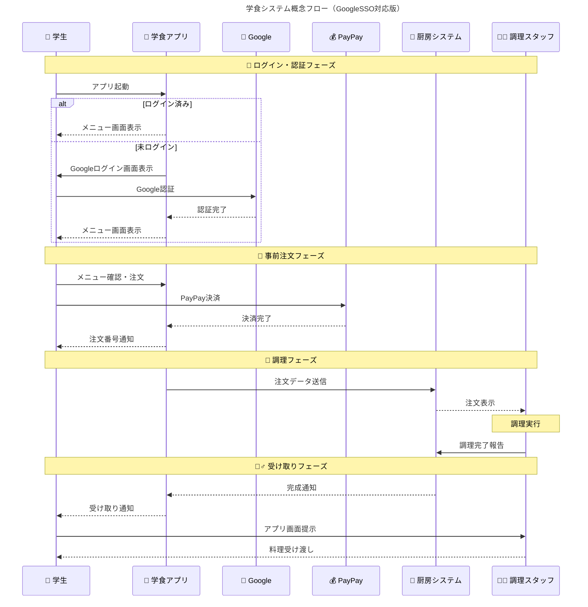
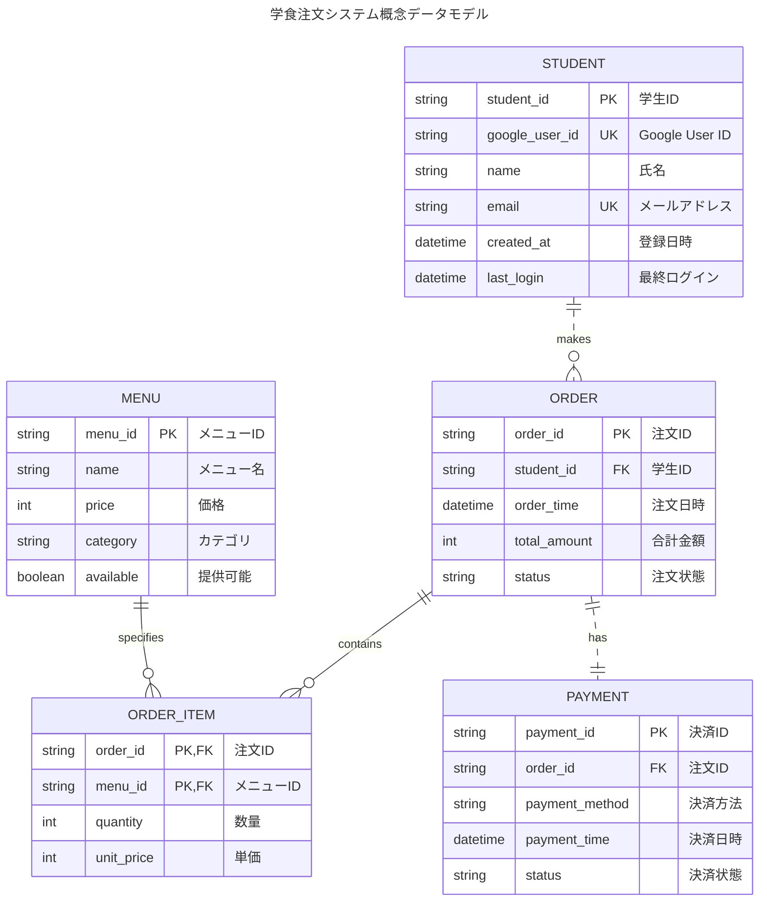

# システム化計画

## このシステムの目的

- 学食の注文の際に券売機前での長い行列ができてしまい注文に時間がかかる問題を解決する
- 厨房側での注文確認から提供までの時間短縮を図る

## 対象

- 学食を利用する学生
- 厨房に立つ調理スタッフ

## 効果

- 待ち時間が減り気軽に来れるようになることで、利用者の増加
- スマホアプリからメニューをチェックできるので、「こんなメニューがあるんだ、行ってみようか！」と利用したことのない人の新規開拓に繋がる
- 現在の食券を受け取ってから調理をするというプロセスから、事前に確認できることで事前の準備が可能になり、業務の効率化が図れる

## 新システムのイメージ

### ユーザー側（学生）

- 専用アプリを使用して学食メニューを注文
- PayPay で決済が可能
- 受け取り時にスマホアプリで受け取り画面を調理スタッフに見せる
- Google シングルサインオンでログインする

### 厨房側（調理スタッフ）

- 注文が一覧で表示される
- 注文内容を確認できる
- スマホアプリに表示された注文番号と照合し受け渡す

---

---

### リンク

[PayPay 開発者向けドキュメント アプリコール](https://developer.paypay.ne.jp/products/docs/appinvoke)
