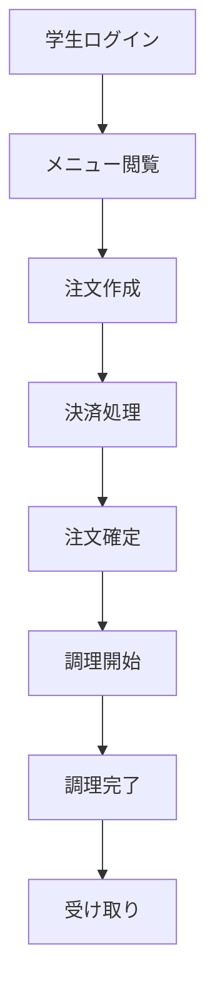
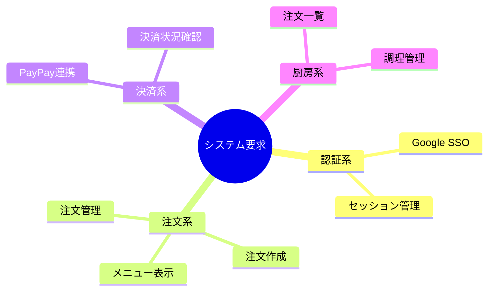
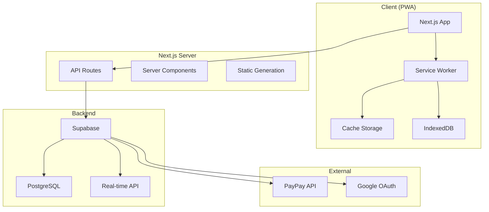
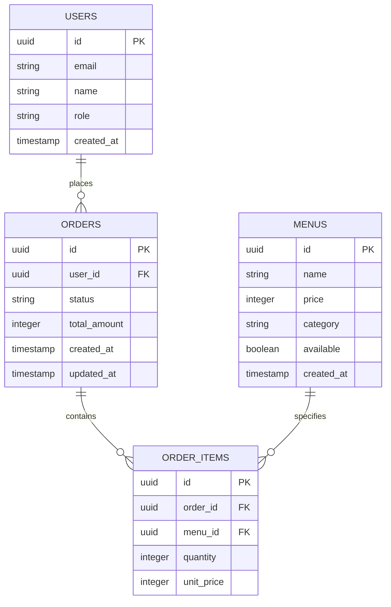

# 小規模校向け学食注文システム - 50 日間集中学習計画

## 🎯 プロジェクト概要

**プロジェクト名**: GAKUSYOKU-PASS（小規模校向け学食注文システム）  
**学習期間**: 50 日間（約 7 週間）  
**開発体制**: 1 人  
**学習目標**: システム開発の上流工程（要求定義・要件定義・基本設計）の実践的習得

---

## 📊 対象システム設定

### 基本仕様

- **対象**: 学生数 1,000 名の小規模校（専門学校・短大想定）
- **予算**: 200 万円以内
- **調理スタッフ**: 2-3 名
- **営業時間**: 11:30-13:30（昼食時間 2 時間）
- **想定利用者**: 200 名/日（学生の 20%）

### 制約条件

- **技術制約**: Next.js + Tailwind CSS + Supabase
- **予算制約**: 200 万円以内での実現
- **人的制約**: IT リテラシーは基本レベル
- **時間制約**: 3 ヶ月以内での稼働開始
- **プラットフォーム**: Web アプリ（PWA 対応でモバイル体験向上）

---

## 🔧 採用技術・ツール

### 文書作成・図表作成

- **Markdown**: 技術文書作成
- **Mermaid 記法**: フローチャート、ER 図、シーケンス図
- **Excel/Google Sheets**: 表計算・分析
- **GitHub**: 文書管理・バージョン管理

### プロトタイプ開発

- **Next.js**: フルスタック Web アプリケーション開発
- **Tailwind CSS**: スタイリング
- **Supabase**: 簡易バックエンド（無料枠活用）
- **PWA 機能**: モバイルアプリライクな体験

### 開発環境

- **VS Code**: エディタ
- **GitHub**: バージョン管理
- **Node.js**: JavaScript 実行環境
- **npm/yarn**: パッケージ管理

---

## 📱 モバイル対応方針

### Swift アプリ開発について

**結論**: 50 日間・1 人開発では **含まれません**

**理由**:

- **学習コスト**: Swift 言語と iOS 開発の習得に追加時間が必要
- **開発工数**: ネイティブアプリ開発は単独で 30-40 日必要
- **環境制約**: macOS + Xcode + Apple Developer Program が必要
- **保守負荷**: Web 版とモバイル版の二重管理

### 代替案: PWA（Progressive Web App）

**採用理由**:

- **技術統一**: Next.js で一つのコードベース
- **モバイル体験**: アプリライクなユーザー体験
- **インストール可能**: ホーム画面への追加
- **プッシュ通知**: Service Worker による通知機能
- **オフライン対応**: キャッシュ機能

---

## 🗓️ 50 日間スケジュール

### Week 1-2: 市場調査・要求分析フェーズ（14 日間）

#### 📋 Week 1（Day 1-7）: 市場調査・現状分析

**目標**: 市場理解と現状課題の明確化

| 日  | 作業内容                           | 成果物               | 工数 |
| --- | ---------------------------------- | -------------------- | ---- |
| 1   | 類似システム調査（国内サービス）   | 競合調査シート       | 4h   |
| 2   | 類似システム調査（海外サービス）   | 機能比較表           | 4h   |
| 3   | PWA 事例・技術調査                 | PWA 技術選定資料     | 4h   |
| 4   | 小規模校の現状調査（Web 調査）     | 現状課題整理書       | 4h   |
| 5   | 技術トレンド調査（Next.js 生態系） | 技術選定候補リスト   | 4h   |
| 6   | 法的・規制要件調査                 | 法的要件整理書       | 4h   |
| 7   | Week 1 振り返り・整理              | 調査結果統合レポート | 4h   |

#### 📋 Week 2（Day 8-14）: ステークホルダー分析・要求抽出

**目標**: ステークホルダーの明確化と要求の抽出

| 日  | 作業内容                       | 成果物                        | 工数 |
| --- | ------------------------------ | ----------------------------- | ---- |
| 8   | ステークホルダー分析           | ステークホルダー分析シート    | 4h   |
| 9   | ペルソナ設定（学生・スタッフ） | ペルソナ設定書                | 4h   |
| 10  | 現状業務フロー分析             | As-Is 業務フロー図（Mermaid） | 4h   |
| 11  | 課題・問題点の整理             | 課題整理表                    | 4h   |
| 12  | ビジネス要求の抽出             | ビジネス要求一覧              | 4h   |
| 13  | 業務要求の抽出                 | 業務要求一覧                  | 4h   |
| 14  | Week 2 振り返り・要求整理      | 要求分析レポート              | 4h   |

### Week 3-4: 要件定義・制約整理フェーズ（14 日間）

#### 📋 Week 3（Day 15-21）: システム要求・制約整理

**目標**: システム要求の明確化と制約条件の整理

| 日  | 作業内容                       | 成果物                     | 工数 |
| --- | ------------------------------ | -------------------------- | ---- |
| 15  | システム要求の抽出             | システム要求一覧           | 4h   |
| 16  | 要求の階層化・分類             | 要求階層図（Mermaid）      | 4h   |
| 17  | 制約条件の整理（PWA 制約含む） | 制約条件一覧               | 4h   |
| 18  | 要求の優先順位付け             | 要求優先順位表             | 4h   |
| 19  | 要求から要件への変換           | 要件変換表                 | 4h   |
| 20  | 要求トレーザビリティ作成       | トレーザビリティマトリクス | 4h   |
| 21  | Week 3 振り返り・要求確定      | 要求明確化書               | 4h   |

#### 📋 Week 4（Day 22-28）: 機能・非機能要件定義

**目標**: 機能要件・非機能要件の詳細定義

| 日  | 作業内容                             | 成果物           | 工数 |
| --- | ------------------------------------ | ---------------- | ---- |
| 22  | 機能要件の詳細定義                   | 機能要件定義書   | 4h   |
| 23  | 非機能要件の詳細定義（PWA 要件含む） | 非機能要件定義書 | 4h   |
| 24  | システム境界の明確化                 | システム境界図   | 4h   |
| 25  | 外部システム連携の整理               | 外部連携仕様書   | 4h   |
| 26  | PWA 機能要件の整理                   | PWA 要件定義書   | 4h   |
| 27  | 代替案の検討                         | 代替案比較表     | 4h   |
| 28  | Week 4 振り返り・要件確定            | 要件定義書       | 4h   |

### Week 5-6: 基本設計・詳細設計フェーズ（14 日間）

#### 📋 Week 5（Day 29-35）: システム全体設計

**目標**: システム全体像の設計

| 日  | 作業内容                      | 成果物                    | 工数 |
| --- | ----------------------------- | ------------------------- | ---- |
| 29  | システム全体図の作成          | システム全体図（Mermaid） | 4h   |
| 30  | システム構成の設計            | システム構成図            | 4h   |
| 31  | 技術選定・アーキテクチャ設計  | 技術選定書                | 4h   |
| 32  | データフロー設計              | データフロー図（Mermaid） | 4h   |
| 33  | セキュリティ設計              | セキュリティ設計書        | 4h   |
| 34  | 性能設計・PWA 設計            | 性能・PWA 設計書          | 4h   |
| 35  | Week 5 振り返り・全体設計確定 | 基本設計書（全体編）      | 4h   |

#### 📋 Week 6（Day 36-42）: 詳細設計

**目標**: 機能・データベース・UI 設計

| 日  | 作業内容                                | 成果物                           | 工数 |
| --- | --------------------------------------- | -------------------------------- | ---- |
| 36  | データベース設計                        | ER 図（Mermaid）・テーブル設計書 | 4h   |
| 37  | API 設計（Next.js API Routes）          | API 仕様書                       | 4h   |
| 38  | 画面設計・UI 設計（モバイルファースト） | 画面設計書・ワイヤーフレーム     | 4h   |
| 39  | 機能詳細設計                            | 機能詳細設計書                   | 4h   |
| 40  | 業務フロー設計（To-Be）                 | To-Be 業務フロー図（Mermaid）    | 4h   |
| 41  | 運用設計                                | 運用設計書                       | 4h   |
| 42  | Week 6 振り返り・詳細設計確定           | 詳細設計書                       | 4h   |

### Week 7-8: プロトタイプ・検証フェーズ（8 日間）

#### 📋 Week 7（Day 43-49）: Next.js + PWA プロトタイプ開発

**目標**: 設計検証のための動作するプロトタイプ作成

| 日  | 作業内容                                 | 成果物                   | 工数 |
| --- | ---------------------------------------- | ------------------------ | ---- |
| 43  | 開発環境構築（Next.js + Tailwind + PWA） | 開発環境                 | 4h   |
| 44  | Supabase プロジェクト設定・DB 設計実装   | Supabase 設定            | 4h   |
| 45  | 認証機能実装（Supabase Auth）            | 認証機能プロトタイプ     | 4h   |
| 46  | 学生用画面実装（レスポンシブ対応）       | 学生用 PWA プロトタイプ  | 4h   |
| 47  | スタッフ用画面実装（管理機能）           | スタッフ用プロトタイプ   | 4h   |
| 48  | PWA 機能実装・統合テスト                 | PWA 対応プロトタイプ     | 4h   |
| 49  | Week 7 振り返り・改善点整理              | プロトタイプ評価レポート | 4h   |

#### 📋 Week 8（Day 50）: 総括・振り返り

**目標**: 学習成果の整理と今後の課題抽出

| 日  | 作業内容                   | 成果物         | 工数 |
| --- | -------------------------- | -------------- | ---- |
| 50  | 全体振り返り・学習成果整理 | 学習成果報告書 | 8h   |

---

## 📊 Mermaid 記法による図表作成計画

### Week 2: 業務フロー図

### Week 3: システム要求関係図

### Week 5: システム構成図（Next.js + PWA）

### Week 6: データベース設計（ER 図）

---

## 📋 最終成果物一覧

### 主要成果物

1. **要求明確化書** - 要求分析の結果（Mermaid 図表含む）
2. **要件定義書** - システム要件の詳細定義
3. **基本設計書** - システム全体設計（Next.js + PWA）
4. **詳細設計書** - 機能・データベース・UI 設計
5. **PWA プロトタイプ** - Next.js + Supabase による動作確認
6. **学習成果報告書** - 学習プロセスと成果の整理

### 補助成果物

- 市場調査レポート（PWA 事例含む）
- ステークホルダー分析書
- 制約条件整理書（PWA 制約含む）
- 技術選定書（Next.js 選定根拠）
- 運用設計書
- プロトタイプ評価レポート

---

## 💰 Supabase 無料枠制約と対策

### 無料枠制限

- **データベース**: 500MB
- **API リクエスト**: 1 日あたり 5 万回
- **認証ユーザー**: 1 万人まで
- **ストレージ**: 1GB
- **帯域幅**: 1 ヶ月 2GB

### 制約への対策計画

- **データ最適化**: 不要なデータの削除戦略
- **リクエスト最適化**: Next.js ISR/SSG によるキャッシュ活用
- **画像最適化**: Next.js Image Optimization の活用
- **定期的な監視**: 使用量の確認とアラート設定

---

## 🎯 技術選定の利点

### Next.js 採用理由

- **✅ 利点**:
  - フルスタック開発（API Routes）
  - SSG/ISR による高性能
  - PWA 対応が容易
  - 本格的なプロダクション対応
- **⚠️ 考慮点**:
  - 学習コストが React より高い
  - サーバーサイド概念の理解が必要

### PWA 採用理由

- **✅ 利点**:
  - ネイティブアプリライクな体験
  - インストール可能
  - オフライン対応
  - プッシュ通知対応
  - 単一コードベースで管理
- **⚠️ 考慮点**:
  - iOS での機能制限
  - Service Worker の複雑さ

### Mermaid 記法

- **✅ 利点**:
  - テキストベースでバージョン管理可能
  - GitHub で自動レンダリング
  - 修正が容易
  - 学習コストが低い
- **⚠️ 注意点**:
  - 複雑な図は表現に限界
  - カスタマイズ性に制限

---

## 🎯 学習効果を最大化するポイント

### 1. **現実的な制約設定**

- **市場調査**: 類似システムの価格・機能調査
- **技術制約**: 実際の開発環境を想定
- **人的制約**: 現実的な開発体制
- **PWA 制約**: ネイティブアプリとの違いを理解

### 2. **段階的な複雑度管理**

- **各段階での振り返り**: 前段階の課題を次段階で解決
- **段階間の連続性**: 設計の一貫性を保持
- **複雑度の段階的増加**: 学習効果の最大化

### 3. **実践的な体験**

- **実際の意思決定**: 制約条件下での選択
- **トレードオフの経験**: 機能・性能・コストの最適化
- **文書化の実践**: 実際の開発で使用される文書作成

### 4. **Next.js + PWA の特性理解**

- **フルスタック思考**: フロントエンド・バックエンド統合
- **パフォーマンス最適化**: SSG/ISR/画像最適化
- **モバイル体験**: レスポンシブ・PWA 機能

---

## 📅 技術別週次チェックポイント

### Week 1 終了時

- [ ] 競合調査完了（PWA 事例含む）
- [ ] 現状課題明確化
- [ ] 技術選定候補決定（Next.js + Tailwind + Supabase + PWA）
- [ ] 基本的な Mermaid 記法習得

### Week 2 終了時

- [ ] ステークホルダー分析完了
- [ ] 業務フロー図作成（Mermaid）
- [ ] 要求抽出完了
- [ ] 要求明確化書作成

### Week 3 終了時

- [ ] システム要求整理完了
- [ ] 制約条件明確化（PWA 制約含む）
- [ ] 要求トレーサビリティ確保（Mermaid 図）
- [ ] Next.js/PWA の基本学習完了

### Week 4 終了時

- [ ] 機能要件定義完了
- [ ] 非機能要件定義完了（PWA 要件含む）
- [ ] 要件定義書完成
- [ ] Supabase の基本学習完了

### Week 5 終了時

- [ ] システム全体設計完了（Mermaid 図）
- [ ] 技術選定完了（Next.js + PWA + Supabase）
- [ ] 基本設計書完成
- [ ] 開発環境構築準備完了

### Week 6 終了時

- [ ] 詳細設計完了
- [ ] データベース設計完了（ER 図：Mermaid）
- [ ] UI 設計完了（レスポンシブ + PWA）
- [ ] API 設計完了（Next.js API Routes）

### Week 7 終了時

- [ ] Next.js + PWA プロトタイプ完成
- [ ] 認証機能実装完了
- [ ] 基本的な CRUD 操作実装完了
- [ ] PWA 機能（インストール・通知）実装完了

### Week 8 終了時

- [ ] 学習成果整理完了
- [ ] GitHub リポジトリ整理完了
- [ ] 技術文書（Markdown + Mermaid）完成
- [ ] 今後の課題抽出完了

---

## 🎯 最終的な技術習得目標

### フロントエンド

- **Next.js**: App Router、Server Components、API Routes
- **Tailwind CSS**: ユーティリティファースト CSS、レスポンシブデザイン
- **PWA**: Service Worker、Web App Manifest、プッシュ通知

### バックエンド

- **Supabase**: リアルタイムデータベース、認証、API
- **PostgreSQL**: SQL クエリ、リレーショナルデータベース設計
- **Next.js API**: サーバーサイド処理、API 設計

### 開発ツール

- **Git**: バージョン管理、GitHub
- **Node.js**: JavaScript 実行環境
- **npm**: パッケージ管理

### 設計・文書化

- **Mermaid**: システム図、フローチャート、ER 図
- **Markdown**: 技術文書作成
- **システム設計**: 要求分析、要件定義、基本設計

---

## 🚀 50 日間完了後の成果

### 1. **Next.js フルスタック開発スキル**

- モダンな React フレームワーク
- SSG/ISR による高性能 Web アプリ
- API Routes によるバックエンド開発

### 2. **PWA 開発スキル**

- ネイティブアプリライクな Web 体験
- オフライン対応・プッシュ通知
- モバイルファーストデザイン

### 3. **システム設計スキル**

- 要求分析から実装までの一貫した設計
- 制約条件を考慮した技術選定
- 段階的な開発計画の立案

### 4. **文書化・コミュニケーションスキル**

- Mermaid 記法による視覚的な図表作成
- 技術文書の作成
- 設計意図の明確な伝達

---

## 💡 成功のための最終アドバイス

### 1. **技術学習の並行実施**

- プロジェクト期間中も継続的に技術学習
- Next.js 公式ドキュメントの活用
- PWA 関連技術の理解

### 2. **実践的なアプローチ**

- 理論だけでなく実際の設計・実装
- 小さな機能から段階的に構築
- 動作確認を重視した開発

### 3. **記録・共有の重要性**

- 学習過程の詳細な記録
- GitHub での成果物公開
- 技術コミュニティでの発信

### 4. **柔軟性の確保**

- 計画の適宜見直し
- 技術的な課題への対応
- 学習効果の最大化
